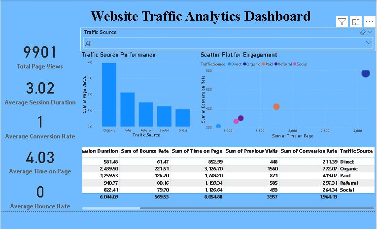

# 🌐 Website Traffic Analytics Dashboard | Power BI Project  

---
## 📅 Project Duration
**Aug 2025 – Aug 2025**
---

## 📌 Project Overview  
This Power BI project provides an **interactive dashboard** to analyze website traffic and user engagement.  
It helps businesses track **performance metrics** and make **data-driven decisions** to improve conversions and retention.  

---

## 📊 Key Insights Covered  
- **Page Views** – Identify which pages attract the most traffic  
- **Session Duration** – Track how long users stay on the website  
- **Bounce Rate** – Measure the % of users leaving after one page  
- **Time on Page** – Evaluate content engagement  
- **Previous Visits** – Understand return visitors vs new users  
- **Conversion Rate** – Track success of marketing efforts  

---

## 🛠️ Tools & Skills Applied  
- **Microsoft Power BI** – Dashboard & Visualization  
- **DAX** – Calculated measures & KPIs  
- **Power Query** – Data cleaning & transformation  
- **Data Modeling** – Relationships between web metrics  

---

## 📸 Dashboard Preview  
(Add screenshots in a folder and embed like this:)  
  

---

## 🎯 Use Cases  
✔️ Marketing teams to optimize campaigns  
✔️ Web analytics for digital strategy  
✔️ Management reporting on KPIs  

---

## 📂 Repository Structure  
